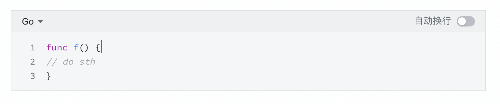
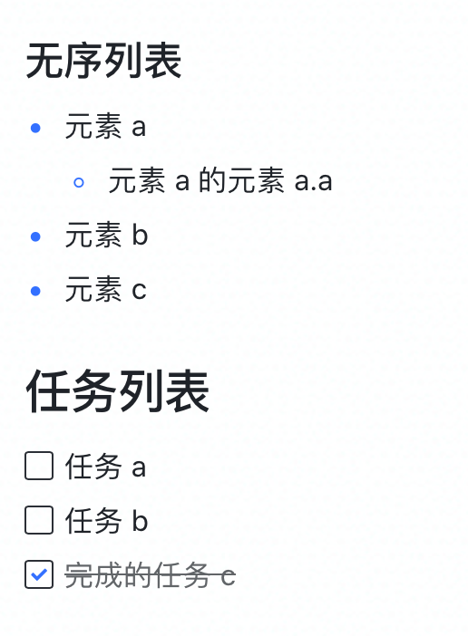
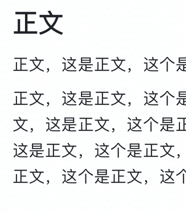

📔 这是一个飞书文档的例子
> 这是一个飞书文档的例子，包含所有 Markdown 支持的语法


# 标题

## 二级标题

### 三级标题

#### 四级标题

##### 五级标题

###### 六级标题

# 正文
正文，这是正文，这个是正文，这个是正文啊。

正文，这是正文，这个是正文，这个是正文啊。正文，这是正文，这个是正文，这个是正文啊。正文，这是正文，这个是正文，这个是正文啊。正文，这是正文，这个是正文，这个是正文啊。正文，这是正文，这个是正文，这个是正文啊。正文，这是正文，这个是正文，这个是正文啊。正文，这是正文，这个是正文，这个是正文啊。

# 列表

## 有序列表
1. 1
   1. A
      1. i
         1. 1
            1. a
            2. b
            3. X
         2. 2
         3. 3
      2. Ii
      3. Iii
      4. iv
      5. Dd
   2. B
   3. C
   4. D
   5. E
   6. F
   7. G
2. 2
3. 3

## 无序列表
- X
   - XX
      - XXX
         - XXX 
            - XXXX
- X
- X

# 任务列表
- [ ] 任务 x
   - [ ] 任务 xx
- [ ] 任务 x
- [x] 完成的任务 x

# 高亮块
```
高亮块

高亮块支持颜色，转成 Markdown 后不支持
```

# 分割线

---

# 引用
> 这是一个引用


> 这是一个引用，有 tab


> 引用行 1
>
> 引用行 2
>
> 引用行 3


# 代码块
```Go
func f() {
// do sth
}
```

# 图片

## 一个图片


## 并排图片
 


# 表格
table

# 电子表格
sheet

# 链接
[链接文本](https://ply.readthedocs.io/en/latest/ply.html)

# 网页卡片
不支持的飞书文档组件: 未知组件

# 云文档
https://rs6qnacjws.feishu.cn/docs/doccnKOgFFoPz5Z1OZ5wU9H7sdf

# 群名片
不支持的飞书文档组件: 群名片

# 文件
[pending.png](./1-static/boxcnBne2oNxLjcnSTFURxU0czv.png)

