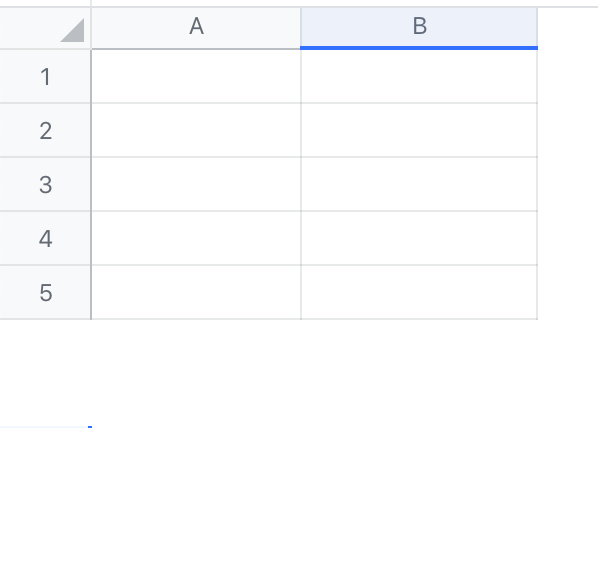
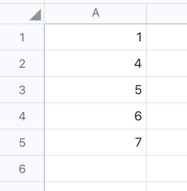
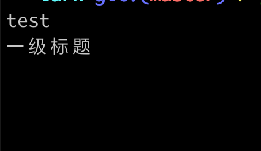

# Lark SDK Ext 使用指南

> Lark SDK 项目：https://github.com/chyroc/lark
> Lark SDK Ext 是在 Lark SDK 上层，面向 Drive/Sheet/Doc 等操作封装的一层方法
> 注意：下面所有的 ctx 都是指在一次请求过程的上下文，是标准库 `context.Context` 的实例

# 一些例子

- 将图片马赛克化，并填充到 Sheet：https://github.com/chyroc/draw-lark-sheet
# 初始化 Lark 客户端

```Go
package main

import (
    "github.com/chyroc/lark"
)

func main() {
    larkClient := lark.New(
       lark.WithAppCredential(r.AppID, r.AppSecret)
    )
}

```
> 注意：下面所有的 `larkCli` 都是指的 Lark SDK 客户端
# Folder / 文件夹

## 创建我的空间跟目录 Folder Client

```Go
package main

import (
   "context"

   "github.com/chyroc/lark"
   "github.com/chyroc/lark/larkext"
)

func example(ctx context.Context, larkClient *lark.Lark) {
   folderRootClient, err := larkext.NewRootFolder(ctx, r)
   if err != nil {
      panic(err)
   }

   _ = folderRootClient
}

```
## 从已有的 Folder Token 创建 Folder Client

```Go
package main

import (
   "context"

   "github.com/chyroc/lark"
   "github.com/chyroc/lark/larkext"
)

func example(ctx context.Context, larkClient *lark.Lark, folderToken string) {
   folderClient := larkext.NewFolder(larkClient, folderToken)
}

```
> 注意：下面提到的 `folderClient` 都是指这样创建的 Folder Client

## 获取文件夹的元信息

```Go
package main

import (
   "context"

   "github.com/chyroc/lark/larkext"
)

func example(ctx context.Context, folderClient *larkext.Folder) {
   meta, err := folderClient.Meta(ctx)
   if err != nil {
      panic(err)
   }

   _ = meta
}

```
## 列出一个文件下的文件列表

```Go
package main

import (
   "context"

   "github.com/chyroc/lark/larkext"
)

func example(ctx context.Context, folderClient *larkext.Folder) {
   files, err := folderClient.ListFiles(ctx)
   if err != nil {
      panic(err)
   }

   _ = files
}

```
## 在文件夹内创建文件夹

```Go
package main

import (
   "context"

   "github.com/chyroc/lark/larkext"
)

func example(ctx context.Context, folderClient *larkext.Folder) {
   childFolderClient, err := folderClient.NewFolder(ctx, "child")
   if err != nil {
      panic(err)
   }

   _ = childFolderClient
}

```
## 在文件夹内创建文档 Doc

```Go
package main

import (
   "context"

   "github.com/chyroc/lark/larkext"
)

func example(ctx context.Context, folderClient *larkext.Folder) {
   docClient, err := folderClient.NewDoc(ctx, "doc title")
   if err != nil {
      panic(err)
   }

   _ = docClient
}

```
## 在文件夹内创建表格 Sheet

```Go
package main

import (
   "context"

   "github.com/chyroc/lark/larkext"
)

func example(ctx context.Context, folderClient *larkext.Folder) {
   sheetClient, err := folderClient.NewSheet(ctx, "sheet title")
   if err != nil {
      panic(err)
   }

   _ = sheetClient
}

```
## 删除文档

```Go
package main

import (
   "context"

   "github.com/chyroc/lark/larkext"
)

func example(ctx context.Context, folderClient *larkext.Folder) {
   err := folderClient.DeleteDoc(ctx, "doc-token")
   if err != nil {
      panic(err)
   }
}

```
## 删除表格

```Go
package main

import (
   "context"

   "github.com/chyroc/lark/larkext"
)

func example(ctx context.Context, folderClient *larkext.Folder) {
   err := folderClient.DeleteSheet(ctx, "sheet-token")
   if err != nil {
      panic(err)
   }
}

```
# Sheet / 电子表格

## Sheet 使用前说明

### 表格坐标、索引

表格以左上角第一个单元格作为原点，坐标是：`(1, 1)`，体现为 Sheet 坐标就是：`A1`。
横向是 X 轴，从左往右增加；纵向是 Y 轴，从上往下增加。

### 将横坐标 X 轴，从数字转成 `A` `Z` `AZ` 等格式

```Go
package main

import (
   "github.com/chyroc/lark/larkext"
)

func exampled() {
   larkext.ItoCol(1)  _// A_
_   _larkext.ItoCol(26) _// Z_
_   _larkext.ItoCol(27) _// AA_
}

```
将单元格范围 `(x1, y1) , (x2, y2)` 转成 `sheet!A1:D3` 格式
```Go
package main

import (
   "github.com/chyroc/lark/larkext"
)

func exampled() {
   larkext.CellRange("sheet1", 1, 1, 2, 2)      _// sheet1!A1:B2_
_   _larkext.CellRange("sheet1", 1, 100, 26, 200) _// sheet1!A100:Z200_
}

```
## 从已有的 Sheet 创建 Sheet 客户端

```Go
package main

import (
   "context"

   "github.com/chyroc/lark"
   "github.com/chyroc/lark/larkext"
)

func example(ctx context.Context, larkClient *lark.Lark, sheetToken string) {
   sheetClient := larkext.NewSheet(larkClient, sheetToken)

   _ = sheetClient
}

```
> 注意：下面所有的 `sheetClient` 都是指 larkext.Sheet 实例

## 创建新的 Sheet，并创建它的客户端

```Go
package main

import (
   "context"

   "github.com/chyroc/lark/larkext"
)

func example(ctx context.Context, folderClient *larkext.Folder) {
   sheetClient, err := folderClient.NewSheet(ctx, "sheet title")
   if err != nil {
      panic(err)
   }

   _ = sheetClient
}

```

## 获取 Sheet 元数据

```Go
package main

import (
   "context"

   "github.com/chyroc/lark/larkext"
   "github.com/davecgh/go-spew/spew"
)

func example(ctx context.Context, sheetIns *larkext.Sheet) {
   meta, err := sheetIns.Meta(ctx)
   if err != nil {
      panic(err)
   }
   spew.Dump(meta)
}

```
## 获取 Sheet 数据

```Go
package main

import (
   "context"
   "fmt"

   "github.com/chyroc/lark"
   "github.com/chyroc/lark/larkext"
)

func example(ctx context.Context, sheetIns *larkext.Sheet) {
   cellRange := larkext.CellRange("sheet-id", 1, 1, 10, 10)
   resp, err := sheetIns.Get(ctx, cellRange, &lark.GetSheetValueReq{})
   if err != nil {
      panic(err)
   }
   for _, vv := range resp.ValueRange.Values {
      for _, v := range vv {
         switch v.Type() {
         case lark.SheetContentTypeString:
            fmt.Println(*v.String)
         case lark.SheetContentTypeInt:
            fmt.Println(*v.Int)
         }
      }
   }
}

```
## 删除 Sheet 自己

```Go
package main

import (
   "context"

   "github.com/chyroc/lark/larkext"
)

func example(ctx context.Context, sheetIns *larkext.Sheet) {
   err := sheetIns.Delete(ctx)
   if err != nil {
      panic(err)
   }
}

```


## 设置 Sheet 标题

```Go
package test

import (
   "context"

   "github.com/chyroc/lark/larkext"
)

func example(ctx context.Context, sheetIns *larkext.Sheet) {
   sheetIns.SetTitle(ctx, "this is title")
}

```

## 设置工作表标题

```Go
package main

import (
   "context"

   "github.com/chyroc/lark/larkext"
)

func example(ctx context.Context, sheetClient *larkext.Sheet) {
   err := sheetClient.SetSheetTitle(ctx, "sheet-id", "sheet title")
   if err != nil {
      panic(err)
   }
}

```

## 设置工作表位置

```Go
package main

import (
   "context"

   "github.com/chyroc/lark/larkext"
)

func example(ctx context.Context, sheetClient *larkext.Sheet) {
   err := sheetClient.SetSheetIndex(ctx, "sheet-id", 1)
   if err != nil {
      panic(err)
   }
}

```
## 隐藏工作表

```Go
package main

import (
   "context"

   "github.com/chyroc/lark/larkext"
)

func example(ctx context.Context, sheetClient *larkext.Sheet) {
   err := sheetClient.HideSheet(ctx, "sheet-id", true)
   if err != nil {
      panic(err)
   }
}

```

## 冻结行与列

```Go
package main

import (
   "context"

   "github.com/chyroc/lark/larkext"
)

func example(ctx context.Context, sheetClient *larkext.Sheet) {
   _// 冻结 1-2 行，1-3（A-C） 列_
_   _{
      err := sheetClient.FrozenSheet(ctx, "sheet-id", 2, 3)
      if err != nil {
         panic(err)
      }
   }

   _// 取消冻结_
_   _{
      err := sheetClient.FrozenSheet(ctx, "sheet-id", 0,0)
      if err != nil {
         panic(err)
      }
   }
}

```
## 锁定工作表

```Go
package main

import (
   "context"

   "github.com/chyroc/lark/larkext"
)

func example(ctx context.Context, sheetClient *larkext.Sheet) {
   err := sheetClient.LockSheet(ctx, "sheet-id", "lock-info", nil)
   if err != nil {
      panic(err)
   }
}

```

## 解锁工作表

```Go
package main

import (
   "context"

   "github.com/chyroc/lark/larkext"
)

func example(ctx context.Context, sheetClient *larkext.Sheet) {
   err := sheetClient.UnlockSheet(ctx, "sheet-id")
   if err != nil {
      panic(err)
   }
}

```
## 移动行数据

```Go
package main

import (
   "context"

   "github.com/chyroc/lark"
   "github.com/chyroc/lark/larkext"
)

func example(ctx context.Context, sheetClient *larkext.Sheet, sheetID string) {
   _ = sheetClient.MoveRows(ctx, sheetID, 3, 2, -1)
}

```
> 将第 3 行开始，连续 2 行的数据，向上（负号表示上）移动 1 行
> 上面的数据会被积压下来


## 移动列数据

```Go
package main

import (
   "context"

   "github.com/chyroc/lark"
   "github.com/chyroc/lark/larkext"
)

func example(ctx context.Context, sheetClient *larkext.Sheet, sheetID string) {
   _ = sheetClient.MoveCols(ctx, sheetID, 3, 2, -2)
}

```
> 将第 3 列开始，连续 2 列的数据，向左（负号 表示左）移动 2 列
> 左边的数据会被挤压到右边

## 插入行数据

```Go
package main

import (
   "context"

   "github.com/chyroc/lark"
   "github.com/chyroc/lark/larkext"
)

func example(ctx context.Context, sheetClient *larkext.Sheet, sheetID string) {
   _ = sheetClient.InsertRows(ctx, sheetID, 3, 2)
}

```
> 从第 3 行开始，插入连续 2 行的空数据
> 原本第3、4行的数据会被挤压到下边


## 插入列数据

```Go
package main

import (
   "context"

   "github.com/chyroc/lark"
   "github.com/chyroc/lark/larkext"
)

func example(ctx context.Context, sheetClient *larkext.Sheet, sheetID string) {
   _ = sheetClient.InsertCols(ctx, sheetID, 3, 2)
}

```
> 从第 3 列开始，插入连续 2 列的空数据
> 原本第3、4列的数据会被挤压到右边

## 增加行

```Go
package main

import (
   "context"

   "github.com/chyroc/lark"
   "github.com/chyroc/lark/larkext"
)

func example(ctx context.Context, sheetClient *larkext.Sheet, sheetID string) {
   err := sheetClient.AddRows(ctx, sheetID, 2)

   _ = err
}

```
> 给只有 5 行的工作表，增加 2 行

## 增加列

```Go
package main

import (
   "context"

   "github.com/chyroc/lark"
   "github.com/chyroc/lark/larkext"
)

func example(ctx context.Context, sheetClient *larkext.Sheet, sheetID string) {
   err := sheetClient.AddCols(ctx, sheetID, 2)

   _ = err
}

```
> 给只有 A B 两列的工作表，增加 2 列

## 追加数据

```Go
package main

import (
   "context"

   "github.com/chyroc/go-ptr"
   "github.com/chyroc/lark"
   "github.com/chyroc/lark/larkext"
)

func example(ctx context.Context, sheetClient *larkext.Sheet, sheetID string) {
   err := sheetClient.Append(ctx, sheetID"!A:C", [][]lark.SheetContent{
      {
         {String: ptr.String("string value")},
         {Link: &lark.SheetValueLink{Text: "Google", Link: "https://google.com/"}},
      },
      {
         {Formula: &lark.SheetValueFormula{Text: "=A1"}},
         {AtDoc: &lark.SheetValueAtDoc{ObjType: "sheet", Text: "shtcnkAi6Xr5Nl6I0LAaGxWjRzd"}},
      },
   }, nil)
   if err != nil {
      panic(err)
   }
}

```
> 默认情况下，从第二行开始的非空数据会被覆盖

> 可以指定追加数据模式为 `INSERT_ROWS`

## 设置行的可见性

```Go
package main

import (
   "context"

   "github.com/chyroc/lark"
   "github.com/chyroc/lark/larkext"
)

func example(ctx context.Context, sheetClient *larkext.Sheet, sheetID string) {
   err := sheetClient.SetRowsVisible(ctx, sheetID, 2, 2, false)

   _ = err
}

```
> 将第 2 行开始的连续的 2 行，设置为 不可见

## 设置列的可见性

```Go
package main

import (
   "context"

   "github.com/chyroc/lark"
   "github.com/chyroc/lark/larkext"
)

func example(ctx context.Context, sheetClient *larkext.Sheet, sheetID string) {
   err := sheetClient.SetColsVisible(ctx, sheetID, 2, 2, false)

   _ = err
}

```
> 将第 2 列开始的连续的 2 列，设置为 不可见

## 设置行的高度

> 默认的行高是 27
```Go
package main

import (
   "context"

   "github.com/chyroc/lark"
   "github.com/chyroc/lark/larkext"
)

func example(ctx context.Context, sheetClient *larkext.Sheet, sheetID string) {
   err := sheetClient.SetRowsSize(ctx, sheetID, 2, 2, 54)

   _ = err
}

```
> 将第 2 行开始的连续 2 行的行高，设置为 54

## 设置列的宽度

> 默认的列宽是 105
```Go
package main

import (
   "context"

   "github.com/chyroc/lark"
   "github.com/chyroc/lark/larkext"
)

func example(ctx context.Context, sheetClient *larkext.Sheet, sheetID string) {
   err := sheetClient.SetRowsSize(ctx, sheetID, 2, 2, 50)

   _ = err
}

```
> 将第 2 列开始的连续 2 列的列宽，设置为 50

## 删除行

```Go
package main

import (
   "context"

   "github.com/chyroc/lark"
   "github.com/chyroc/lark/larkext"
)

func example(ctx context.Context, sheetClient *larkext.Sheet, sheetID string) {
   err := sheetClient.DeleteRows(ctx, sheetID, 2, 2)

   _ = err
}

```
> 删除第 2 行开始的连续 2 行

## 删除列

```Go
package main

import (
   "context"

   "github.com/chyroc/lark"
   "github.com/chyroc/lark/larkext"
)

func example(ctx context.Context, sheetClient *larkext.Sheet, sheetID string) {
   err := sheetClient.DeleteCols(ctx, sheetID, 2, 2)

   _ = err
}

```
> 删除第 2 列开始的连续 2 列

## 设置单元格样式

```Go
package main

import (
   "context"

   "github.com/chyroc/go-ptr"
   "github.com/chyroc/lark"
   "github.com/chyroc/lark/larkext"
)

func example(ctx context.Context, sheetClient *larkext.Sheet, sheetID string) {
   err := sheetClient.SetCellStyle(ctx, sheetID+"!A1:C3", &lark.SetSheetStyleReqAppendStyleStyle{
      Font: &lark.SetSheetStyleReqAppendStyleStyleFont{
         Bold:     ptr.Bool(true),
         Italic:   ptr.Bool(true),
         FontSize: ptr.String("10pt/1.5"),
      },
      TextDecoration: ptr.Int64(3),
      HAlign:         ptr.Int64(1),
      VAlign:         ptr.Int64(1),
      ForeColor:      ptr.String("#000000"),
      BackColor:      ptr.String("#21d11f"),
   })

   _ = err
}

```
> 设置 A1 到 C3 区域内，加粗，删除线，切下划线，背景色

## 清除单元格样式

```Go
package main

import (
   "context"

   "github.com/chyroc/lark/larkext"
)

func example(ctx context.Context, sheetClient *larkext.Sheet, sheetID string) {
   err := sheetClient.CleanCellStyle(ctx, larkext.CellRange(sheetID, 1, 1, 3, 3))

   _ = err
}

```
> 清除单元格上所有的样式

## 合并单元格

```Go
package main

import (
   "context"

   "github.com/chyroc/lark"
   "github.com/chyroc/lark/larkext"
)

func example(ctx context.Context, sheetClient *larkext.Sheet, sheetID string) {
   err := sheetClient.MergeCell(ctx, sheetID+"!A1:C3", "MERGE_ALL")

   _ = err
}

```
> mergeType 选择 MERGE_ALL，将 A1 到 C3 合并为一个单元格

> mergeType 选择 MERGE_ROWS，将 A1 到 C3 按行合并为一个单元格

> mergeType 选择 MERGE_COLUMNS，将 A1 到 C3 按行合并为一个单元格

## 取消合并单元格

```Go
package main

import (
   "context"

   "github.com/chyroc/lark"
   "github.com/chyroc/lark/larkext"
)

func example(ctx context.Context, sheetClient *larkext.Sheet, sheetID string) {
   err := sheetClient.UnmergeCell(ctx, sheetID+"!A1:C3")

   _ = err
}

```
> 将范围 A2:C2 范围内的合并单元格取消合并

## 单元格写入内容

```Go
package main

import (
   "context"

   "github.com/chyroc/go-ptr"
   "github.com/chyroc/lark"
   "github.com/chyroc/lark/larkext"
   "github.com/davecgh/go-spew/spew"
)

func exampled(ctx context.Context, sheetClient *larkext.Sheet, sheetID string) {
   err := sheetClient.SetSheetValue(ctx, larkext.CellRange(sheetID, 1, 1, 3, 2), [][]lark.SheetContent{
      {
         {String: ptr.String("(1,1) 字符串")},
         {Int: ptr.Int64(100)},
         {Link: &lark.SheetValueLink{Text: "Google", Link: "https://google.com"}},
      },
      {
         {Formula: &lark.SheetValueFormula{Text: "=A1"}},
         {AtDoc: &lark.SheetValueAtDoc{ObjType: "sheet", Text: sheetClient.SheetToken()}},
      },
   })
   _ = err
}

```
> 向一个 3-2 范围的单元格写入内容，包含字符串，数字，链接，公式，文档等

## 单元格写入图片

```Go
package main

import (
   "context"
   "io/ioutil"

   "github.com/chyroc/lark/larkext"
)

func example(ctx context.Context, sheetClient *larkext.Sheet, sheetID, filepath string) {
   images, err := ioutil.ReadFile(filepath)
   if err != nil {
      panic(err)
   }

   _ = sheetClient.SetSheetValueImage(ctx, larkext.CellRange(sheetID, 2, 2, 2, 2), images)
   _ = sheetClient.SetColsSize(ctx, sheetID, 2, 1, 100)
   _ = sheetClient.SetRowsSize(ctx, sheetID, 2, 1, 100)
}

```
> 在 B2 位置写入一张图片，并将这个单元格的高和宽都设置为 100

## 批量写入单元格内容

> 批量写入主要适用于单元格不连续的情况
```Go
package main

import (
   "context"

   "github.com/chyroc/go-ptr"
   "github.com/chyroc/lark"
   "github.com/chyroc/lark/larkext"
   "github.com/davecgh/go-spew/spew"
)

func exampled(ctx context.Context, sheetClient *larkext.Sheet, sheetID string) {
   err := sheetClient.BatchSetSheetValue(ctx, []*lark.BatchSetSheetValueReqValueRange{
      {
         Range: larkext.CellRange(sheetID, 1, 1, 1, 1),
         Values: [][]lark.SheetContent{
            {
               {String: ptr.String("(1,1) 字符串")},
            },
         },
      },
      {
         Range: larkext.CellRange(sheetID, 2, 2, 2, 2),
         Values: [][]lark.SheetContent{
            {
               {Link: &lark.SheetValueLink{Text: "Google", Link: "https://google.com"}},
            },
         },
      },
      {
         Range: larkext.CellRange(sheetID, 3, 3, 3, 3),
         Values: [][]lark.SheetContent{
            {
               {AtDoc: &lark.SheetValueAtDoc{ObjType: "sheet", Text: sheetClient.SheetToken()}},
            },
         },
      },
   })
   _ = err
}

```
> 向单元格的 `(1, 1)`，`(2, 2)`，`(3, 3` 分别写入字符串，链接和文档内容

## 搜索表格

```Go
package main

import (
   "context"
   "fmt"

   "github.com/chyroc/lark"
   "github.com/chyroc/lark/larkext"
)

func example(ctx context.Context, sheetClient *larkext.Sheet, sheetID string) {
   res, err := sheetClient.SearchSheet(ctx, sheetID, "6", nil)
   if err != nil {
      panic(err)
   }
   fmt.Println("march cells:", res.MatchedCells)
   fmt.Println("march formula cells:", res.MatchedFormulaCells)
}

```
> 前三列是数字，第四列是前三列的和，搜索：6，可以搜索出原始单元格 B2，和公式单元格 D1

## 替换表格

```Go
package main

import (
   "context"
   "fmt"

   "github.com/chyroc/lark"
   "github.com/chyroc/lark/larkext"
)

func example(ctx context.Context, sheetClient *larkext.Sheet, sheetID string) {
   _, err := sheetClient.Replace(ctx, sheetID, "6", "replace-6", nil)
   if err != nil {
      panic(err)
   }
}

```
> 前三列是数字，第四列是前三列的和，将 6 替换为 replace-6


# Doc / 文档

## 从已有的 Doc 创建 Doc 客户端

```Go
package main

import (
   "context"

   "github.com/chyroc/lark"
   "github.com/chyroc/lark/larkext"
)

func example(larkClient *lark.Lark, docToken string) {
   docClient := larkext.NewDoc(larkClient, docToken)

   _ = docClient
}

```
## 获取文档元信息

```Go
package main

import (
   "context"

   "github.com/chyroc/lark"
   "github.com/chyroc/lark/larkext"
)

func example(ctx context.Context, docClient *larkext.Doc) {
   meta, err := docClient.Meta(ctx)
   if err != nil {
      panic(err)
   }

   _ = meta
}

```

## 获取文档文本内容

```Go
package main

import (
   "context"
   "fmt"

   "github.com/chyroc/lark"
   "github.com/chyroc/lark/larkext"
)

func example(ctx context.Context, docClient *larkext.Doc) {
   text, err := docClient.RawContent(ctx)
   if err != nil {
      panic(err)
   }

   fmt.Println(text)
}

```
> 获取一个标题为 test 的文档的文本内容

## 获取文档的富文本内容

```Go
package main

import (
   "context"
   "fmt"

   "github.com/chyroc/lark"
   "github.com/chyroc/lark/larkext"
   "github.com/davecgh/go-spew/spew"
)

func example(ctx context.Context, docClient *larkext.Doc) {
   content, err := docClient.Content(ctx)
   if err != nil {
      panic(err)
   }

   spew.Dump(content)
}

```
> 获取一个标题为 test 的文档的富文本内容


